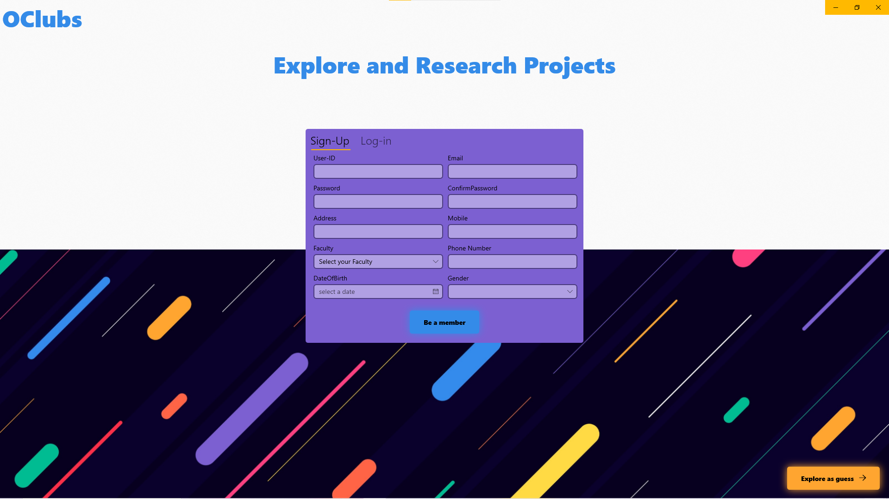
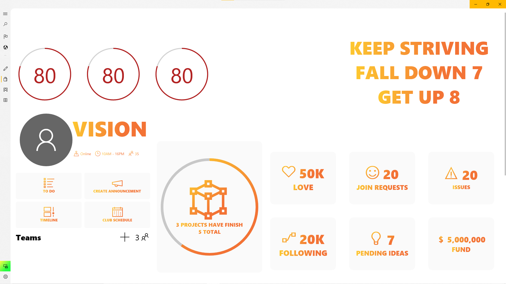

# OClubs (The new IU system client for IU organization) Version 1.1.1
This is the new "NATIVE" IU Client just for Windows 10 that not only run on the newsest Microsoft Technologies but also take advantage
the Windows Echo System . This project will
anything that IU system provide and need:
* IU Services 
* IU Market
* IU Mystery
* IU BlackBoard
---------------
* Clubs 
* Clubs Management
* Online Learning

# Technologies
* UWP (Universal Windows Platform/ XAML and C#)
* .NET Core 3.0 (Web API)
* MSSQL
* Entity Framework Core
* SignalR Core
* Python (Tesseract)
! The backend will be public in another seperate GitHub Repo.

# Supported Features (not yet)

* CRUD for Clubs, IU Market, IU Confession, IU Blackboard
* Real Time (Mystery Chat and Teachers Interaction)
* Quizz Game
* Image Recognition for Sign Up
* Windows Hello (Facial & Fingerprint)

!None, this just a client side rendering UI, backend will be host later

# DEMO
- Login Screen 

- IU Services

- Club Management

# Some Animations Demo
* Club Animation

* IUServices Animation 

* IUMarket Animtion

* Bubble Button

